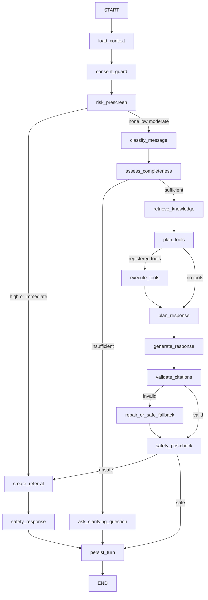

# Hanna Agent graph

Graph identity: `hanna-v1` / semantic version `1.0.0` / state schema `1`.

Every node accepts and returns validated state fields. Side effects exist only in retrieval, tool,
referral, checkpoint and persistence nodes. The turn pins graph, prompt, model-route, tool-registry,
safety-policy and knowledge-index versions. Each completed node writes an encrypted database checkpoint
and a redacted trace; resume uses the last compatible checkpoint and never silently changes graph schema.

Risk screening and safety postcheck are mandatory and are excluded from cost-based degradation. Retrieved
documents and tool outputs are untrusted data. No raw response text reaches the client until citation and
safety validation have passed.
